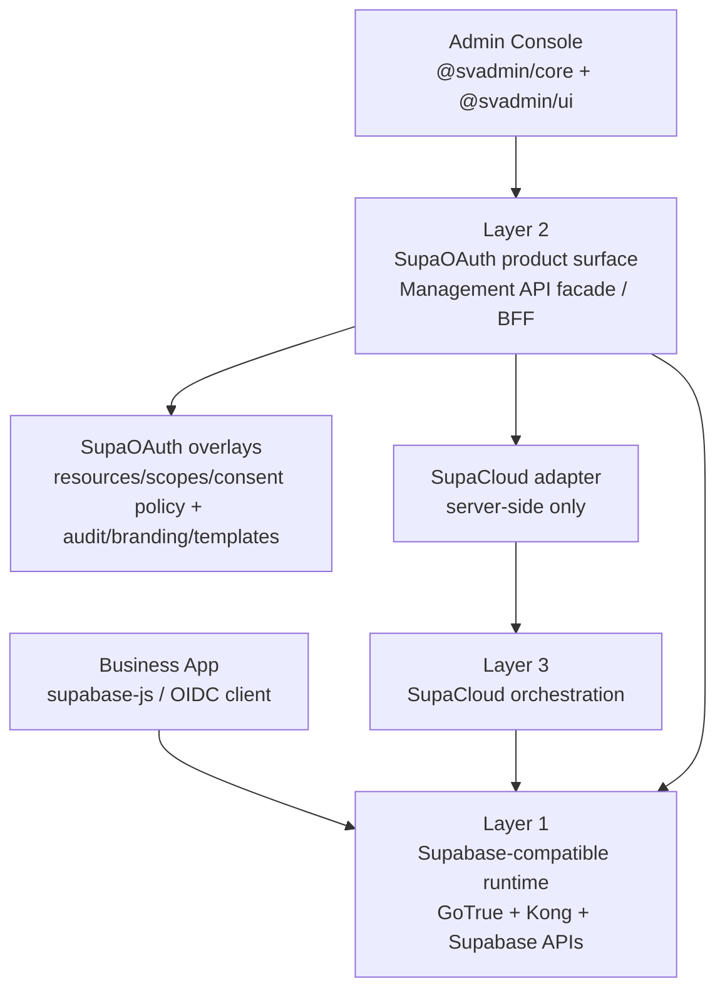

# SupaOAuth Architecture

## Baseline

SupaOAuth is organized as three explicit layers:

1. Supabase-compatible runtime
2. Logto-like product surface
3. SupaCloud orchestration

This split is the architecture baseline. It keeps SupaOAuth product-facing like Logto while preserving Supabase compatibility and avoiding direct infrastructure coupling in the admin console.

## SupaCloud-Native Direction

The target deployment model is SupAuth running inside SupaCloud, not beside it as
an extra production service. GoTrue owns authentication runtime state;
SupaCloud owns enterprise control-plane state; SupAuth provides the UI, hosted
auth experience, BFF and small product overlays. See
`docs/supacloud-native-refactor.md`.

## Layer 1: Supabase-Compatible Runtime

Purpose: keep existing Supabase application behavior working.

Owned by:

- GoTrue
- Kong runtime routes
- Supabase-compatible services such as PostgREST, Storage, Realtime, and Edge Functions

Responsibilities:

- OIDC/OAuth protocol runtime
- Authorization-code redemption and refresh-token grant
- OAuth clients, authorization Grants and consent revocation effects
- Identities and MFA factors
- Session handling
- JWT signing and JWKS
- `auth.users` as the primary identity table
- Supabase-compatible routes:
  - `/auth/v1/*`
  - `/rest/v1/*`
  - `/storage/v1/*`
  - `/realtime/v1/*`
  - `/auth/v1/.well-known/*`
- JWT claims required by Supabase Auth Hooks, RLS, and Supabase clients:
  - `iss`
  - `aud`
  - `exp`
  - `iat`
  - `sub`
  - `role`
  - `aal`
  - `session_id`
  - `email`
  - `phone`
  - `is_anonymous`
- Supabase metadata claims preserved when present:
  - `app_metadata`
  - `user_metadata`

Non-goals:

- Do not expose SupaOAuth management APIs from runtime paths.
- Do not rewrite Supabase client semantics.
- Do not break `supabase-js`, RLS, Storage, Realtime, or Functions authentication.

## Layer 2: Logto-Like Product Surface

Purpose: provide the SupaCloud-hosted user-center product experience without
becoming a second identity-management source of truth.

Owned by:

- `packages/auth-server`
- `packages/admin-console`
- `packages/shared`
- `packages/sdks`

Responsibilities:

- SupaCloud Function BFF and Management API facade
- Admin Console and SDKs
- API resources, scopes, and application/resource bindings
- Hosted auth pages, account claim pages, and sign-in experience overlays
- Connector visibility/display overlays on top of SupaCloud providers
- User management views and safe metadata extension workflows
- OAuth consent policy/decision audit, tenant branding/phrases, custom UI, and
  compatibility helpers; active Grants remain in GoTrue
- Runtime health and compatibility inspection
- SupaCloud-owned control-plane domains are proxied through server-side adapter
  calls: Applications metadata, business Organizations, RBAC, tenant
  collaborators, Audit, Webhooks, Providers and secrets.
- Admin user CRUD and supported MFA reset are delegated to GoTrue. Current-user
  Bearer routes expose documented Grant, opt-in identity, TOTP and scoped logout
  actions. Unsupported administrator session, identity unlink and Grant routes
  stay hidden and return `capability_unavailable`.

This layer stores only SupaOAuth overlay metadata. It must not become an
alternate GoTrue database, RBAC database, webhook store, audit store, or token
issuer.

Supported runtime mode:

- `runtime_mode=gotrue` (the only accepted value)
- GoTrue is the issuer.
- SupaOAuth is the SupaCloud Function BFF, overlay owner, API facade, and runtime verifier.

Non-goals:

- Do not reimplement token signing.
- Do not manage Kong, GoTrue env files, or infrastructure directly from the browser.
- Do not put service-role, SupaCloud master, connector secret, or signing material in `VITE_*` variables.

## Layer 3: SupaCloud Orchestration

Purpose: apply product intent to infrastructure safely.

Owned by:

- `zuohuadong/supacloud`
- SupaCloud Management API
- SupaOAuth server-side SupaCloud adapter

Responsibilities:

- GoTrue instance lifecycle
- GoTrue environment injection
- GoTrue restart/reload orchestration
- Kong route and custom domain setup
- Supabase self-hosted project wiring
- Delegated GoTrue user CRUD and supported MFA reset, plus user-token account
  actions for Grants, opt-in identities, TOTP and scoped logout
- Provider/connector secret delivery
- Applications metadata, Organizations, RBAC, tenant collaborators, Audit and
  Webhooks as control-plane sources of truth
- Managed webhook delivery and background jobs

Non-goals:

- SupaCloud should not define SupaOAuth product UX.
- Admin Console should not call SupaCloud directly.
- Browser code should never hold SupaCloud management credentials.

## Request Flow

## API Boundaries

Runtime APIs:

- Public to business applications.
- Must remain Supabase-compatible.
- Backed by GoTrue and Supabase runtime services.

Management APIs:

- Public only to authenticated admin console and SDK clients.
- Exposed by the SupAuth Function BFF.
- SupaCloud-owned domains are backed by SupaCloud Management API.
- SupaAuth overlay domains use the project database through the `supaoauth` schema.

Orchestration APIs:

- Internal server-to-server boundary.
- Called by SupaOAuth backend only.
- Never called directly from browser code.

## Data Authority

| Domain | Authority | SupaOAuth/SupaCloud role |
| --- | --- | --- |
| `auth.users`, Identity, OAuth clients/Grants | GoTrue | Admin user CRUD plus documented current-user Grant/opt-in identity actions; no unsupported admin facade |
| Session, Refresh Token, MFA factor/AAL | GoTrue | Scoped logout, user-token TOTP and supported admin MFA reset; no session inventory or copied tables |
| JWT signing, JWKS, OAuth/OIDC and `/auth/v1/*` | GoTrue | Preserve and verify; never intercept |
| SupaOAuth application metadata, product Organizations, control-plane RBAC | SupaCloud | Authoritative control-plane APIs |
| Independent application memberships, assignments, business permissions | Application PostgreSQL schema | Application-local authorization kit is optional; facts are not copied into SupAuth or SupaCloud RBAC |
| Webhook delivery, Audit, tenant collaborators | SupaCloud | Durable control-plane APIs |
| Connector/CAPTCHA/Webhook/Auth Hook secrets | SupaCloud Secret Manager | Browser and public APIs receive masked state only |
| Hosted UI, branding and compatibility helpers | SupaOAuth overlay | Additive `supaoauth` schema only |

## Design Rules

- Each product object has one authority. SupaAuth stores only overlay fields and
  never persists a copy of GoTrue runtime state or SupaCloud control-plane state.
- Runtime compatibility is a release blocker, not an optional feature.
- SupaOAuth should present a Logto-like product model but emit Supabase-compatible runtime behavior.
- Features that require replacing GoTrue token semantics are outside the product boundary and must not be advertised or installed.
- Claims added by SupaOAuth use the schema-v2 `app_metadata.supaoauth.projects[projectRef]` namespace and must not break existing RLS policies.
- In `runtime_mode=gotrue`, RBAC is read from SupaCloud and projected into the current project entry / RLS helper functions, not by changing the JWT `role` claim or writing local RBAC source tables. Legacy root-level projection fields fail closed.
- OAuth response `scope` is consent/UserInfo metadata, not a database permission source; database authorization remains in RLS, helper functions, and versioned RBAC lookups.
- See `docs/rbac-supabase-compatibility.md` for the RBAC migration baseline.
- See `docs/application-authorization-kit.md` for the separate application-owned data-plane authorization packages and ownership boundary.

## Architectural Decision: SupAuth and the @supacloud/app Framework

### Context

SupaCloud introduced `@supacloud/app`, an Angular/Nest-style metadata application framework providing `@Module`, `@Injectable`, `@Command`, `@Query`, `@Controller`, static compile-time DI via `@supacloud/compiler`, and agent tool export via `supacloud-cli app export-tools`.

### Decision

1. **SupAuth implements the SupaCloud-Native App Deployment Specification**:
   - It packages as a standard SupaCloud project-scoped application declared in `supacloud-app-manifest.json`.
   - HTTP execution is strictly `supacloud-functions-only` through `packages/auth-server/src/supacloud-function.ts`.
   - Admin Console is statically hosted on SupaCloud Pages (`/admin/*`).
   - Database migrations are additive overlay scripts applied through SupaCloud Management API.

2. **SupAuth does NOT adopt the `@supacloud/app` Domain Framework**:
   - **Distinct JTBD**: `@supacloud/app` is architected for domain-heavy business products (such as Xigu FA) requiring state machines, command-query transactions, outbox dispatch, and LLM tool exports. SupAuth is an infrastructure-level identity gateway, BFF, and hosted auth page renderer. Its security endpoints must not be exposed as agent tools.
   - **Runtime Efficiency**: ElysiaJS provides zero-reflection, functional routing with native Bun / Edge Runtime performance and automatic OpenAPI generation. Wrapping low-latency proxy routes in class-based decorators and static DI modules would introduce unnecessary indirection without architectural benefit.
   - **Stability and Blast Radius**: Central authentication cannot tolerate regressions in GoTrue compatibility, AAL2 MFA gates, or session boundaries.

3. **Facade and Schema Convergence**:
   - All platform-owned domains (Organizations, Roles, Permissions, Assignments, Audit, Webhook Delivery) are 100% delegated to SupaCloud Management API.
   - Legacy temporary tables (`provisioning_records`, `application_secrets`) are retired from initial migrations and must not be used as authoritative state in new projects.
